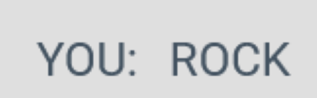
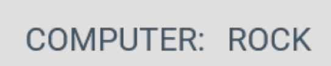

<h1 align='center'>Rock Paper Scissors</h1>

[view the live project here.](https://themanintheback.github.io/Project2/)

This is the main page of the website which provides a playable game of rock paper siccissors. The site is responsive and works on the a range of devices.

<h2 align='center'></h2>

# User Experience (UX)

- ## User Stories

    - ### First Time Vistor Goals

        1. As a First Time Vistor, I want understand the main purpose of the website.

        2. As a First Time Vistor, I want understand the rules of the game without having to need instructions.

        3. As a First Time Vistor, I want the buttons to be responsive so I know they are working.

        4. As a First Time Vistor, I want all informtion to be clearly visable on the screen.

        5. As a First Time Vistor, I want to gain basic understanding of the fundamentals of JavaScript.

        6. As a First Time Vistor, I want to enjoy the game and be challanged by the games difficulty.
    
    - ### Returning  Vistor Goals

        1. As a Returning Vistor, I want to still find the game enjoyable and challanging.

        2. As a Returning Vistor, I still use it to have good grasp of the undamentals of JavaScript.

- ## Design

    - ### Colour Scheme
        - The first main colour is a shade of grey and darkblue (#445361) which is used for the font, icons and buttons (when not hoovered over).

        - The second main  colour is a shade of very light grey (#dfdfdf) for the sites 
        background colour.

# Technologies Used

- ## Languages Used

    - HTML 
    
    - CSS

    - JavaScripty

- ## Libraies & Programes used

    1. Hover.CSS
        - Hover.CSS was used on the button icons to change there colour when the user runs there cursor
        over them.

    1. Google Fonts
        - Google fonts was used to import the 'Roboto' font into the style.CSS file for the project.

    1. Font Awesome
        - Font Awsome was used throuught the projects main page for aesthetic and UX purposes.

    1. Git
        - Git was used for version with Gitpod terminal to commit to Git and push to GitHub.

    1. GitHUb
        - GitHub was used to store the projects code after being pushed from Git

# Features

- ## Heading
    - ### Placed at the top of the page is the games heading ROCK PAPER SCISSORS all in capital letters making easy to see and read for the user.

<h2 align='center'></h2>

- ## Icons

    - ### Directly underneath the Heading there are two icons used to represent the player and computer.

    - ### The icon of the person is used to let the user know that information underneath it is refering to themselves.

    - ### The icon of the computer is used to let the users know that information underneath it is refering to the  computer.

    - ### The icons are also used for aesthetic purposes.

<h2 align='center'></h2>

- ## Display Area

    - ### underneath the icons are words YOU and COMPUTER

    - ### When the user picks Rock, Paper or Scissors there choice will be displayed next the word YOU:

    - ### At the same time the computers choice will also be displayed to the user next to the word COMPUTER:

    

    </h2>