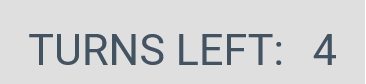
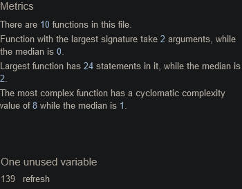

<h1 align='center'>Rock Paper Scissors</h1>

[view the live project here.](https://themanintheback.github.io/Project2/)

This is the main page of the website which provides a playable game of rock, paper & siccissors. The site is responsive and works on a range of devices.

<h2 align='center'></h2>

# User Experience (UX)

- ## User Stories

    - ### First Time Vistor Goals

        1. As a First Time Vistor, I want understand the main purpose of the website.

        2. As a First Time Vistor, I want understand the rules of the game without having the need for instructions.

        3. As a First Time Vistor, I want the buttons to be responsive so I know they are working.

        4. As a First Time Vistor, I want all the informtion to be clearly visable on the screen.

        5. As a First Time Vistor, I want to gain a basic understanding of the fundamentals of JavaScript.

        6. As a First Time Vistor, I want to enjoy the game and be challanged by the games difficulty.
    
    - ### Returning  Vistor Goals

        1. As a Returning Vistor, I want to still find the game enjoyable and challanging.

        2. As a Returning Vistor, I still use it to have good grasp on the undamentals of JavaScript.

- ## Design

    - ### Colour Scheme

        - The first main colour is a shade of grey and darkblue (#445361) which is used for the font, icons and buttons (when not hovered over).

        - The second main colour is a shade of very light grey (#dfdfdf) for the sites 
        background colour.

# Technologies Used

- ## Languages Used

    - HTML 
    
    - CSS

    - JavaScript

- ## Libraies & Programes used

    1. Hover.CSS
        - Hover.CSS was used on the button icons to change there colour when the user runs there cursor
        over them.

    1. Google Fonts
        - Google fonts was used to import the 'Roboto' font into the style.CSS file for the project.

    1. Font Awesome
        - Font Awsome was used throuught the projects main page for aesthetic and UX purposes.

    1. Git
        - Git was used for version control with Gitpod terminal to commit to Git and push to GitHub.

    1. GitHUb
        - GitHub was used to store the projects code after being pushed from Giti

# Features

- ## Heading
    - Placed at the top of the page is the games heading ROCK PAPER SCISSORS all in capital letters making it easy to see and read for the user.

<h2 align='center'></h2>

- ## Icons

    - Directly underneath the Heading there are two icons used to represent the player and computer.

    - The icon of the person is used to let the user know that information underneath it is referring to themselves.

    - The icon of the computer is used to let the users know that information underneath it is referring to the computer.

    - The icons are also used for aesthetic purposes.

<h2 align='center'></h2>

- ## Display Area

    - Underneath the icons are the words YOU: and COMPUTER:

    - When the user picks Rock, Paper or Scissors there choice will be displayed next the word YOU:

    - At the same time the computers choice will also be displayed to the user next to the word COMPUTER:

    <h2 align='center'></h2>

    <h2 align='center'></h2>

- ## Button Area

    - These are the buttons the user will be clicking to choose Rock, Paper or Scissors.
    
    - The icon I used to represent Rock is a closed fist.

    - The icon I used to represent Paper is a open palm.

    - The icon I used to represent Scissors is a hand sticking two fingers out to the side.

    - The buttons will change to different colour when the users cursor hovers over them.

    -  Names for the button have been placed underneath for the user, so they understand what each 
    button represents.

    <h2 align='center'></h2>

- ## Turns Area

    - Underneath the buttons there is a display showing how many turns the user has left before the game ends.

    - The user has 5 turns, it counts down from 5 - 0 

    - When the user has had 5 turns the game end and will be told if they have won or lost by an alert pop-up in the users broswer.

    - The page will refresh and the game will start again.

    <h2 float='left'>
    
    
    </h2>
     
- ## Score Area

    - Underneath the TURNS LEFT display is the display of the user and computer score.

    - The WIN score will go up 1 point if the user beats the computers choice.

    - The LOST score will go up 1 point if the computer beats the users choice.

    <h2 align='center'></h2>
    <h2 align='center'></h2>

- ## Restart Button

    - Underneath the Score Area is the RESTART button.

    - The button will refresh the page therfore starting the game again for the user.

    - The button creates a level of convince for the user.

    - The button will change to a different colour when the users cursor hovers over it. 

    <h2 align='center'></h2>

# Testing

- ## Validator Testing

    - ### HTML

        - No errors were returned when passing through official W3C Validator.

        - Only 1 warning about my section element has no heading, but the heading is placed above the section element in the code.

        <h2 align='center'></h2>

    - ### CSS

        - No errors were found when passing through the official Jigsaw Validator.
        
        <h2 align='center'></h2>

    - ### JavaScript

        - No errors were found when passing through the official Jshint Vaildator.

            - The following metrics were returned:

            - There 7 functions in this file.

            - Function with the largest signature takes 2 arguments, while the median is 0.

            - Largest function has 24 statements in it, while the median is 7.

            - The most complex functions has a cyclomatic complexity value of 8 while the median is 2.

            - One unused variable "refresh".
            
        <h2 float='left'></h2>

- ## Bugs

    - The word SCISSORS cannot be placed directly underneath its button proprely because the
    word is to long.

    - The word RESTART cannot be placed directly underneath its button proprely because the word is to long.

- ## Deployment

    - The site was deployed to GitHub Pages. The steps to deploy are as follows:

        - In the GitHub repositorie, navigate to the Settings tab.

        - From the Generals page in Settings, on the left side Go to the Code and Automation section
        and click Pages which will take you to GitHUb Pages.

        - Once inside go to Source and select Main branch and select Save.

        - The page will refresh and the site will be successfully be deployed.

    The live link can be found here -  https://themanintheback.github.io/Project2/

- ## LightHoues Test
    - The results are as follows:
    - Performance: 94
    - Accessibility: 79
    - Best Practices: 92
    - SEO: 91

    <h2 align='center'></h2
# Credits

- ## Code

    - Some of the structure of the JS code came from a coder on a Youtube video found [her](https://www.youtube.com/watch?v=RwFeg0cEZvQ&t=559s)

    - Styling of the buttons was taken from the Love Maths Project.

- ## Content

    - The Icons at the top of the page (person and compter) and buttons where taken from Font Awesome.
    